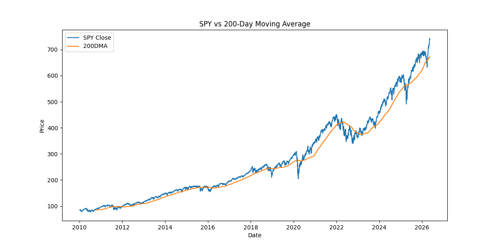
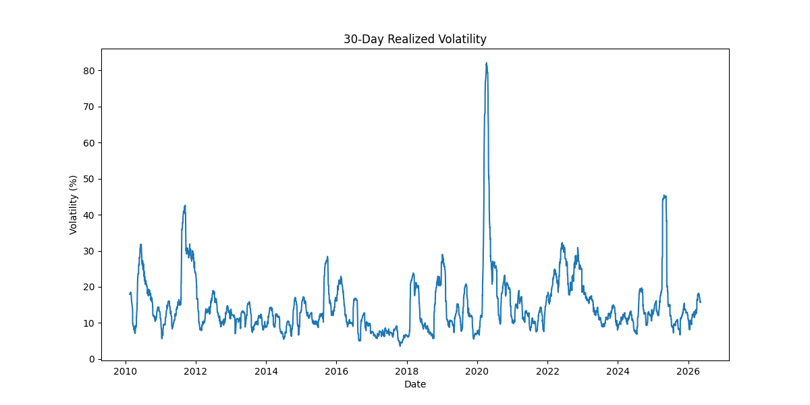
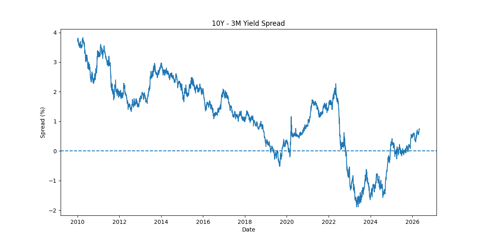
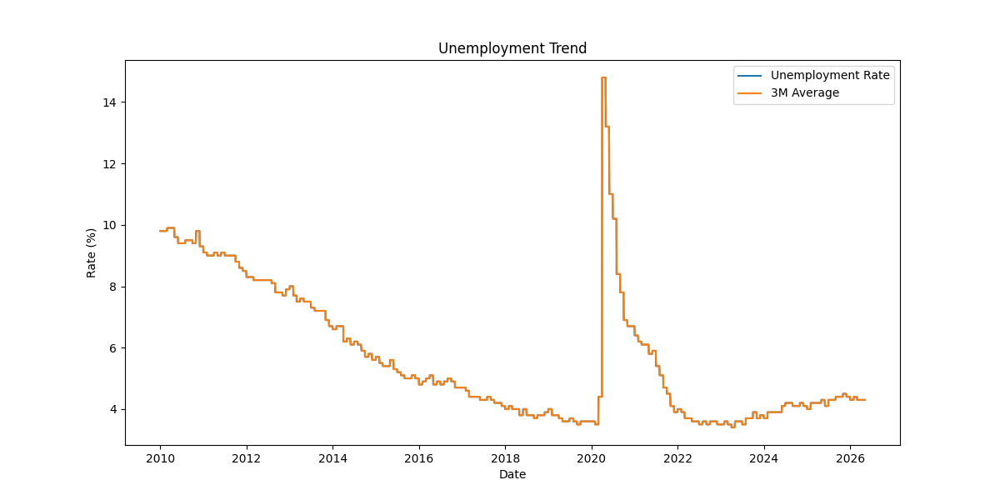

# Weekly Market Intelligence Report

Date: 2026-05-13

---

# Executive Summary

Current Market Regime: **Neutral / Watchlist**

Total Risk Score: **40**

---

# Market Indicators

| Indicator | Value |
|---|---|
| SPY Close | 742.31 |
| 200DMA | 672.19 |
| Distance from 200DMA | 10.43% |
| 30D Volatility | 10.93% |
| Drawdown | 0.0% |

---

# Macro Signals

| Signal | Value |
|---|---|
| Yield Spread (10Y-3M) | 0.76 |
| Unemployment Rate | 4.3% |
| 3M Avg Unemployment | 4.3% |
| 3M Unemployment Change | 0.0 |

---

# Risk Scoring Breakdown

## Market Risk

| Component | Score |
|---|---|
| Trend Score | 5 |
| Volatility Score | 5 |
| Drawdown Score | 5 |
| Total Market Risk | 15 |

---

## Macro Risk

| Component | Score |
|---|---|
| Yield Spread Score | 20 |
| Unemployment Score | 5 |
| Total Macro Risk | 25 |

---

# Charts

## SPY vs 200DMA

---

## 30D Volatility

---

## Yield Spread

---

## Unemployment Trend

---

# Interpretation

This report evaluates current market conditions using technical and macroeconomic indicators.

The scoring model combines trend, volatility, drawdown, yield curve structure, and labor market dynamics into a unified market regime framework.

---

# Disclaimer

This report is for educational and informational purposes only and does not constitute investment advice.
